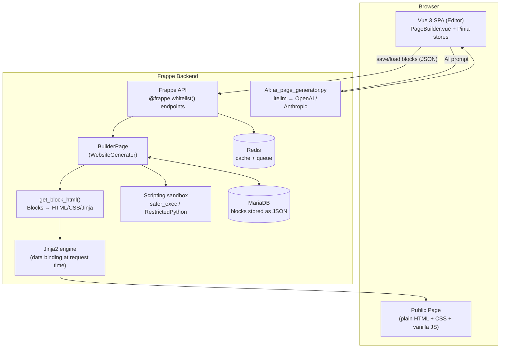

# Frappe Builder — Copilot Instructions

## Project Overview

**Frappe Builder** is a visual page builder built on [Frappe Framework](https://docs.frappe.io/framework). It has two distinct layers:

- **Frontend** — Vue 3 + TypeScript SPA (Vite) in `frontend/`
- **Backend** — Python Frappe app in `builder/` (doctypes, API, AI integration)

The frontend builds to `builder/public/frontend/`. The workspace is a pnpm/yarn workspace with `frappe-ui` as a local package.

## Essential Commands

```bash
# Dev server
cd apps/builder && yarn dev          # Vite dev server on :8080

# Build
cd apps/builder && yarn build        # Production build

# Backend tests
bench --site builder.test run-tests --app builder --coverage

# Frontend e2e
cd apps/builder && yarn test-local   # Cypress UI
cd apps/builder && yarn test         # Headless
```

## Architecture



- **Block system** — Every page is a tree of `Block` objects serialized as JSON in `BuilderPage.blocks`. See [block-system instructions](.github/instructions/block-system.instructions.md).
- **Scripting** — Three layers: page data script (Python/server), block data script (Python/per-block), block client script (JS/browser). See [scripting instructions](.github/instructions/scripting.instructions.md).
- **AI integration** — `builder/ai_page_generator.py` uses litellm for multi-provider LLM access. See [ai instructions](.github/instructions/ai-integration.instructions.md).
- **State management** — Pinia stores in `frontend/src/stores/`. No global singletons outside stores.
- **Data fetching** — Always use `frappe-ui` resource helpers (`createResource`, `createListResource`, `createDocumentResource`). Never use raw axios/fetch.

## Detailed Instructions

| Concern | File |
|---------|------|
| Vue, TypeScript, Pinia, Tailwind, frappe-ui | [frontend.instructions.md](.github/instructions/frontend.instructions.md) |
| Python, Frappe doctypes, API, permissions | [backend.instructions.md](.github/instructions/backend.instructions.md) |
| Block system data model + rendering pipeline | [block-system.instructions.md](.github/instructions/block-system.instructions.md) |
| AI / LLM integration | [ai-integration.instructions.md](.github/instructions/ai-integration.instructions.md) |
| Scripting (page data, block data, client scripts) | [scripting.instructions.md](.github/instructions/scripting.instructions.md) |

## Performance — Non-Negotiable

Performance is a core product value. **Every change must be evaluated for its performance impact.**

### Frontend
- **Lazy-load all route components** — dynamic `import()` always, no exceptions
- **Avoid unnecessary reactivity** — don't make deeply nested objects reactive if only shallow access is needed; use `toRaw()` before passing to non-reactive contexts
- **`v-if` over `v-show`** for components that are rarely visible (avoid mounting hidden trees)
- **`frappe-ui` resource caching** — always set `cache: "<key>"` for data that doesn't change per-user or per-session
- **No synchronous blocking on the main thread** — defer heavy work with `nextTick()` or `requestAnimationFrame()`
- **Minimize store subscriptions** — only subscribe to the slice of state a component actually uses
- **Chunk size limit is 1500KB** — audit imports; tree-shake aggressively; avoid importing entire libraries when only one utility is needed

### Backend
- **`frappe.get_cached_doc()`** over `frappe.get_doc()` for read-only lookups — it uses Redis
- **`frappe.db.get_value()`** over fetching a full document when only one field is needed
- **`@redis_cache`** decorator for expensive computed functions that are called repeatedly per request
- **`frappe.get_list()`** with explicit `fields=[]` — never fetch `*`; always list only what you need
- **`enqueue_doc()` for any operation > ~200ms** — preview generation, image conversion, analytics ingestion all use background queues
- **Avoid N+1 queries** — fetch related data in bulk with `get_list(filters={"name": ["in", ids]})` not in a loop

### Rendering pipeline
- `get_block_html()` runs on every public page request — keep it allocation-light
- Use `frappe.get_cached_doc()` inside `get_context()` and related helpers — never `get_doc()` for settings or component lookups
- Page-level caching: set `context.no_cache = 1` **only** when the page genuinely requires per-request data (dynamic routes, page data scripts, block data scripts)

## Quick Rules

- **Tabs** for indentation in all files (frontend and backend)
- **Double quotes** in TypeScript/JavaScript
- **`@` alias** → `frontend/src/` — always use it, never use relative imports across folders
- **`frappe.throw()`** in Python, never bare `raise`
- All public Python functions must have `@frappe.whitelist()` and explicit permission checks
- Never store UI state outside a Pinia store; never store domain data in component-local state if it's needed elsewhere
