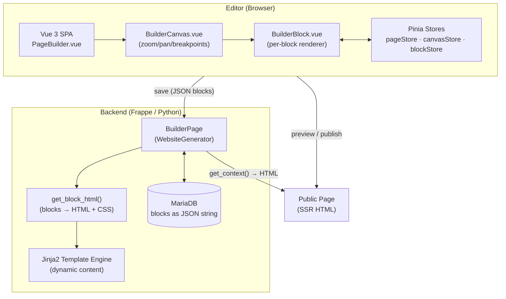
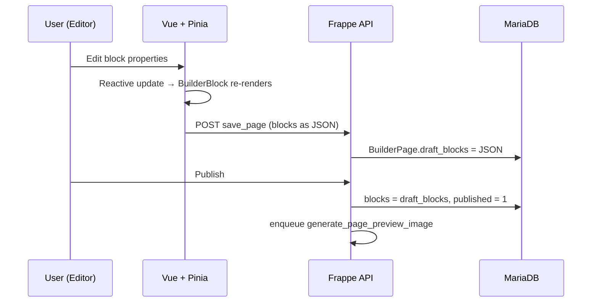
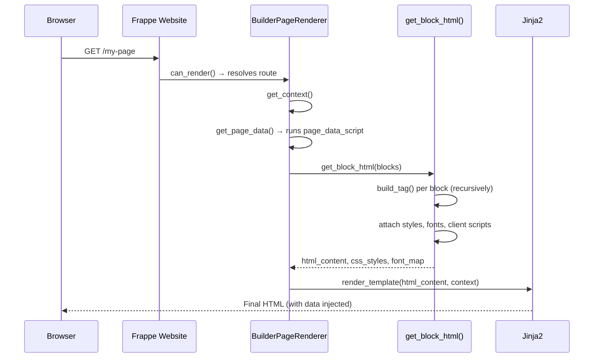

# Block System — Frappe Builder

## Overview

Every page is a **tree of Block objects**. Blocks are the fundamental unit of content and layout. They map 1:1 to DOM elements when rendered.

---

## High-Level Architecture



### Key Architectural Decisions

- **Dual representation**: Blocks live as a reactive class tree in the editor and as a flat JSON string in the database.
- **SSR rendering**: Public pages are fully server-side rendered by Frappe's website generator. The Vue editor is only for authoring.
- **No client-side framework on public pages**: The output is plain HTML + CSS + optional vanilla JS (block client scripts).
- **Jinja as the dynamic layer**: All data binding, repeaters, and visibility conditions emit Jinja `` tags that are evaluated at request time on the server.

---

## Full Data Flow

### Edit → Save → Publish



### HTTP Request → Public Page



---

## Block Data Structure

Defined in `frontend/src/block.ts` as a TypeScript class. The serialized (JSON) schema:

```typescript
interface BlockOptions {
    blockId: string;            // Unique ID — MUST be preserved through edits
    element: string;            // HTML element: "div", "section", "h1", "p", "img", etc.
    blockName?: string;         // Human-readable label
    children: Block[];          // Child blocks (tree)
    baseStyles: BlockStyleMap;  // CSS-in-JS (camelCase) — desktop base styles
    mobileStyles: BlockStyleMap;  // Overrides at ≤576px
    tabletStyles: BlockStyleMap;  // Overrides at ≤768px
    rawStyles: BlockStyleMap;     // Raw CSS strings (e.g., custom animations)
    attributes: BlockAttributeMap; // HTML attributes (src, href, alt, etc.)
    classes: string[];            // Additional CSS class names
    innerText?: string;           // Text content for text elements
    innerHTML?: string;           // Raw HTML (use carefully)
    extendedFromComponent?: string; // Component name if instance of a component
    dataKey?: BlockDataKey | null;  // Dynamic data binding key
    draggable?: boolean;
    visibilityCondition?: string;   // Jinja/JS condition to show/hide at runtime
}
```

---

## Serialization

Blocks are stored as a **JSON string** in `BuilderPage.blocks` (Long Text field). The full page block tree is serialized on save and deserialized on load.

```python
# Backend: parse blocks
import json
blocks = json.loads(page_doc.blocks)  # list of block dicts

# Save blocks
page_doc.blocks = json.dumps(blocks)
page_doc.save()
```

```typescript
// Frontend: save
pageStore.activePage.blocks = JSON.stringify(pageStore.rootBlock);
```

---

## Breakpoints

Builder renders at three breakpoints:
| Breakpoint | Max width | Style key |
|-----------|----------|-----------|
| Desktop | > 1024px | `baseStyles` |
| Tablet | ≤ 768px | `tabletStyles` (merges with baseStyles) |
| Mobile | ≤ 576px | `mobileStyles` (merges with baseStyles + tabletStyles) |

**Backend constants** (in `builder_page.py`):
```python
MOBILE_BREAKPOINT = 576
TABLET_BREAKPOINT = 768
DESKTOP_BREAKPOINT = 1024
```

Responsive style keys in the AI block schema follow `m_style` (mobile) and `t_style` (tablet).

---

## Block Style Rules

Styles are CSS-in-JS (camelCase). Key constraints:

- **Use `%` or `rem` for widths** — never hardcode `px` widths for layout
- **Top-level section blocks must be 100% width**
- **Gradients**: Always use `backgroundImage` (not `background`) for gradients
  ```python
  # ✅ correct
  {"backgroundImage": "linear-gradient(135deg, #667eea 0%, #764ba2 100%)"}
  # ❌ wrong — will not render correctly
  {"background": "linear-gradient(...)"}
  ```
- **Interactive states**: prefix with `hover:` or `active:` in the style key
  ```python
  {"hover:backgroundColor": "#eee", "active:color": "#333"}
  ```
- **Gradients in YAML must be quoted** to prevent YAML parse errors

---

## Element Types

```typescript
// Text elements — have innerText / innerHTML
const TEXT_ELEMENTS = ["span", "h1", "h2", "h3", "h4", "h5", "h6",
                       "p", "b", "label", "a", "cite", "li", "strong",
                       "em", "i", "blockquote"];

// Container elements — have children
const CONTAINER_ELEMENTS = ["section", "div"];
```

**Rule**: Never place text directly inside a `div` or `section` — always wrap in a semantic text element.

---

## Block IDs

- Every block has a `blockId` (UUID)
- IDs are **permanent** — they are used by the selection system, history, and the AI generator
- When modifying blocks (especially via AI), **always preserve existing `blockId` values**
- New blocks: generate a UUID (`frappe.generate_hash()` in Python, `frappe.utils.generateId()` in JS)

---

## Canvas Architecture

The canvas in `BuilderCanvas.vue` renders the block tree:

1. **Root** → `BuilderCanvas.vue` (handles zoom/pan, breakpoint switching, marquee selection)
2. **Each block** → `BuilderBlock.vue` (renders element + children recursively)
3. **Editor overlay** → teleported to `#overlay` (handles resize handles, toolbar)

**Stores involved**:
- `canvasStore` — zoom level, active breakpoint, selected blocks
- `pageStore` — `rootBlock` (root of block tree), `activePage`
- `blockStore` — `blockMap` (blockId → Block instance) for O(1) lookup

---

## Block Manipulation

Use `blockController.ts` functions for block CRUD — do not manipulate the block tree directly in components.

```typescript
import { addBlock, deleteBlock, duplicateBlock, moveBlock } from "@/utils/blockController";

// Add a new child block
addBlock(parentBlock, { element: "div", baseStyles: { padding: "1rem" } });

// Delete a block (handles selection cleanup)
deleteBlock(block);

// Duplicate
duplicateBlock(block);
```

---

## Dynamic Data (dataKey)

Blocks can be bound to dynamic data from Frappe context:

```typescript
interface BlockDataKey {
    key: string;         // field name in context
    type: "attribute" | "style" | "text";
    property?: string;   // which attribute or style property
}
```

Used for Jinja template variable injection at render time.

---

## AI Block Schema (YAML Compression)

When sending blocks to the LLM, they are compressed to a compact YAML schema via `compress_block_to_yaml()`:

```yaml
# Compressed schema used by AI
el: section
id: abc123        # blockId — MUST be preserved
name: Hero Section
style: {width: '100%', padding: '4rem 2rem', backgroundColor: '#1a1a2e'}
c:               # children
  - el: h1
    id: def456
    text: Welcome to Builder
    style: {fontSize: '3rem', color: '#fff'}
  - el: p
    id: ghi789
    text: Build pages visually
    style: {color: '#ccc', marginTop: '1rem'}
```

Key mappings: `el`=element, `id`=blockId, `c`=children, `m_style`=mobileStyles, `t_style`=tabletStyles.

---

## Server-Side Rendering Pipeline

`get_block_html()` in `builder_page.py` is the core rendering function. It converts the JSON block tree into HTML + CSS served to browsers.

```
get_block_html(blocks_json)
├── Parse JSON → list of block dicts
├── For each root block:
│   ├── extend_block_with_component()   ← merge component overrides
│   ├── process_block_props()           ← resolve props stack
│   ├── get_block_context()             ← prepare Jinja context
│   └── build_tag()                     ← recursive HTML construction
│       ├── create_html_tag()           ← BeautifulSoup tag + inline styles
│       ├── render_children() or render_repeater_children()
│       └── attach_client_script()      ← inject block JS if present
├── wrap_html_with_context()            ← wrap in Jinja  blocks
└── Return (html_str, css_str, font_map, has_block_script)
```

The output is **not plain HTML** — it contains Jinja2 ``, ``, `` tags. These are evaluated by Frappe's template engine at request time so that dynamic data (from `page_data_script` or `blockDataScript`) is injected per-request.

### Styles in the renderer

Each block's styles are converted to a CSS class and injected into a `<style>` tag:
- `baseStyles` → `.block-{id} { ... }`
- `mobileStyles` → `@media (max-width: 576px) { .block-{id} { ... } }`
- `tabletStyles` → `@media (max-width: 768px) { .block-{id} { ... } }`
- `rawStyles` → appended as-is

---

## Data Flow Summary

```
User edits block
      ↓
Block instance updated (reactive)
      ↓
BuilderBlock.vue re-renders via reactivity
      ↓
User saves (Cmd+S / auto-save)
      ↓
pageStore.savePage() → JSON.stringify(rootBlock)
      ↓
POST /api/method/... → builder_page.save()
      ↓
DB: BuilderPage.draft_blocks = JSON string

On publish:
draft_blocks → blocks, published = 1
      ↓
Background job: generate_page_preview_image()
      ↓
Public GET /route → get_block_html() → Jinja render → HTML response
```
